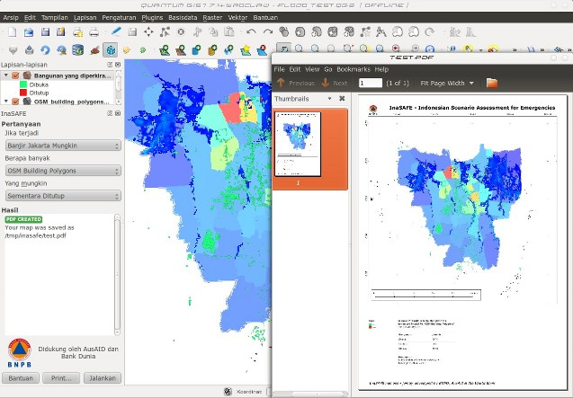
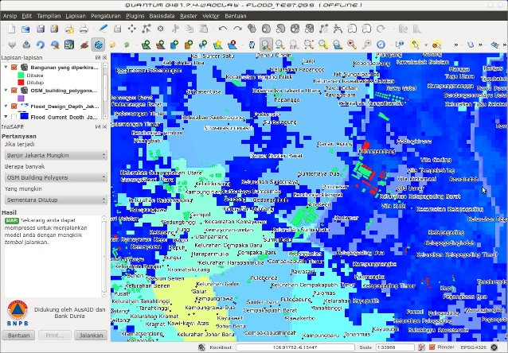

========================================================
InaSAFE - Indonesian Scenario Assessment for Emergencies
========================================================

This is the project: InaSAFE a Quantum GIS plugin

A completed assement using the QGIS InaSAFE plugin, with an example of 
the print ready pdf output the plugin produces.

Vulnerable building footprints shown in red.

For more information about InaSAFE please visit 
`www.inasafe.org <http://www.inasafe.org>`_ and look at the documentation at
`inasafe.readthedocs.org <http://inasafe.readthedocs.org>`_

The latest source code is available at
`aifdr.github.com/inasafe <http://aifdr.github.com/inasafe>`_
which contains modules for risk calculations, gis functionality and functions
for impact modelling.

========================
Quick Installation Guide
========================

.. note::

  InaSAFE is a plugin for `Quantum GIS <http://qgis.org>`_ (QGIS), so
  QGIS must be installed first.

To install the InaSAFE, use the plugin manager in QGIS::

  Plugins -> Fetch Python Plugins

Then search for 'Risk In A Box', select it and click the install button.
The plugin will now be added to your plugins menu.

-------------------
System Requirements
-------------------

 - A standard PC with at least 4GB of RAM running Windows, Linux or Mac OS X
 - The Open Source Geographic Information System QGIS (http://www.qgis.org).
   InaSAFE requires QGIS version 1.7 or newer.

===========
Limitations
===========

InaSAFE is a very new project. The current code development started
in earnest in March 2011 and there is still much to be done.
However, we work on the philosophy that stakeholders should have access
to the development and source code from the very beginning and invite
comments, suggestions and contributions.

As such, InaSAFE currently has some major limitations, including

 * Hazard layers must be provided as raster data
 * Exposure data must be either raster data or vector data but only
   point, line and polygon types are supported.
 * All data must be provided in WGS84 geographic coordinates
 * Neither AIFDR nor GFDRR take any responsibility for the correctness of
   outputs from InaSAFE or decisions derived as a consequence

