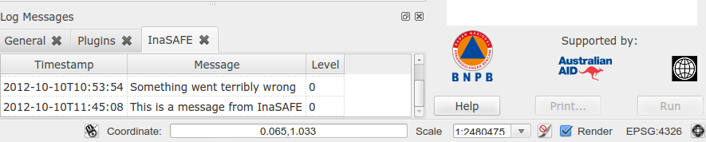

Logging
-------

InaSAFE includes a logging subsystem that can be used to:

* record event messages in the QGIS Log Console
* record event messages to a file e.g.
  :file:`/tmp/inasafe/10-10-2012/timlinux/logs/inasafe.log`
* record exception details to a Sentry installation available at
  http://sentry.linfiniti.com/inasafe/
* email a developer a message when a logging event occurs (currently disabled)

In this section we describe best practices and procedures for logging in
InaSAFE.

Getting and using the named Logger instance
-------------------------------------------

We use the 'InaSAFE' logger instance as standard. It is the responsibility
of each client package (e.g. :samp:`safe_qgis`) to setup the logger - typically
in the :samp:`__init__.py` for the package::

    from utilities import setupLogger
    setupLogger()

The utility method that sets up the logger will determine which logging
backends are made available. In the :samp:`safe_qgis` package, a number of
different backends are setup in the :funct:`setupLogger` function. The
logger will typically be assigned to a module variable :samp:`LOGGER`.

To actually use the logger in your module you need to do something like this::

    import logging
    LOGGER = logging.getLogger('InaSAFE')

    # And then in your class / method:
    LOGGER.debug('Hello world')

Logging exceptions
------------------

It is recommended to log exceptions as per the following example::

    try:
        1/0
    except Exception:
        LOGGER.exception('Something went terribly wrong')

The exception log type will cause the full traceback, the exception message
and the message provided to the LOGGER.exception call to all be logged e.g.::

    2012-10-10 10:53:54,733 - InaSAFE - ERROR - Something went terribly wrong
    Traceback (most recent call last):
      File "<input>", line 2, in <module>
    ZeroDivisionError: integer division or modulo by zero

The above example was contrived in the QGIS python console. When the exception
originates inside a module, the traceback will include the complete call tree.

Remote logging
--------------

There is support for logging to a remote server. This currently intended for
developer use only and will provide ongoing statistics about the number and
nature of exceptions taking place in InaSAFE.

.. note:: For privacy / security reasons this is disabled by default and you
    need to jump through two hoops to make it work.

The remote server is available here: http://sentry.linfiniti.com/inasafe/

Remote logging is implemented using `raven <http://pypi.python.org/pypi/raven>`_
and `sentry <http://pypi.python.org/pypi/sentry>`_. Raven needs to be installed
on the local client. On ubuntu you can install it by doing::

    sudo pip install raven

To prevent user's unwittingly sending exception reports, it is required to
first set an environment variable before starting QGIS / running tests::

    export INASAFE_SENTRY=1

.. note:: The sentry logger is set to only log exceptions.

Here is an example session which will install raven, enable sentry and then
launch QGIS::

    sudo pip install raven
    export INASAFE_SENTRY=1
    /usr/local/bin/qgis

QGIS Log Messages
-----------------

For the :samp:`safe_qgis` package, log messages will also be written to the
QGIS log console under a tab labelled 'InaSAFE'. You can view these messages by
clicking on the small triangular icon in the bottom right corner of the QGIS
main window.

.. figure:: ../_static/log-notifications.png
   :align:   center

Clicking on the triangle indicated in red above will open the log dock window
in QGIS from where you can browse log messages conveniently.

.. note:: QGIS 1.8 or greater is required for this functionality.

Logging with third party applications
-------------------------------------

If you have written your one SAFE library client, you should set up your own
logger instance - just be sure that it is a named logger (called
:samp:`InaSAFE`) and any log messages from the safe library will be written
to your logger. For inspiration on how to do this, take a look at the
 :func:`setupLogger` function in :file:`safe_qgis/utilities.py`.
