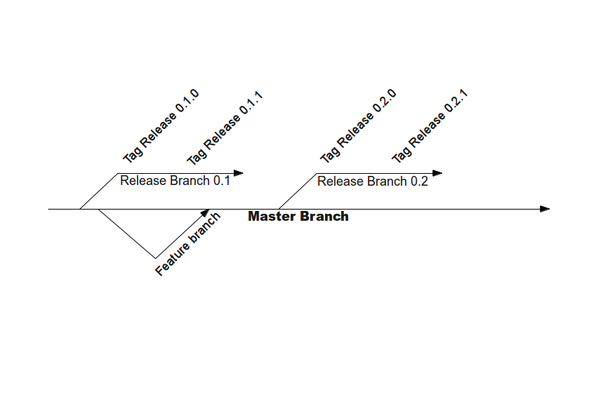

===================
Preparing a release
===================

This document outlines the steps that need to be carried out in order
to issue a new release of the Risk in a Box plugin. The steps can be outlined
as follows and are described in detail below:

+ Identify what version number the new release will be assigned.
+ Close all issues marked as blockers for the release.
+ If needed, create a release branch
+ Update all source files to the new version number.
+ Update all source files for PEP8 and PEP257 compliance.
+ Ensure no assert statements are critical to code flow
+ Ensure that Qt resources and user interface files have been compiled
+ Ensure that user interface files meet HIG compliance
+ Enure all unit tests complete successfully and that tests that are expected
  to fail are documented.
+ Ensure that all translation string lists have been updated and that the
  translation process has been carried out.
+ Ensure that all new and existing features are adequately documented.
+ Ensure that the sphinx documentation is compiled.
+ Generate python optimsed (.pyo) files for all sources.
+ Update the plugin metadata to reflect current version.
+ Generate a test package and validate in a clean room environment.
+ Tag the release in the revision control system.
+ Upload the updated package zip file to old QGIS python plugin repository.
+ Upload the updated package zip file to the new QGIS python plugin repository.
+ Make announcements and press releases as needed.

Release numbering
.................

Risk in a Box will follow the `semantic versioning system <http://semver.org/>`_.
Simply put, the following scheme should be applied to version numbers:

.. table::

   ===================  ============================================================
    Version Increment     Intention
   ===================  ============================================================
    Major e.g 1.0.0     API incompatibility with the previous major release.
    Minor e.g. 1.1.0    API compatibility and extension over previous minor release.
    Point e.g. 1.1.0    API compatibility, bug fixes for previous point release.
    Alpha e.g. 1.0.0a   Feature incomplete preview of a minor or major release
    RC e.g. 1.1.0rc1    Feature complete preview of a minor or major release
   ===================  ============================================================

To identify the next release number, the table above can simply be appled. Here
are a couple of examples.

* You have fixed various bugs without adding new features or breaking the API,
  and you are ready to immediately publish your work. Result: **New point 
  release.**
* You have implemented many new features, some of which required breaking API
  compatibility with the existing major release. Now you would like to make 
  a public preview of your work before committing to a final release. Result:
  **New major release candidate.**

**Outcome:** A version number for the next release eg. 0.1.0.

Issue completion
................

Having determined the release number, you should use the GitHub *labels* 
capability to assign a label matching the release to each blocking ticket. 
There is no fixed rule on which tickets should be tagged for the release - the
best judgment of developers and managers should be used based on severity of
issues, available time to deadline, budget etc.

**Outcome:** At the end of  this step all `issues <https://github.com/AIFDR/risk_in_a_box/issues>`_ 
tagged for the release should be closed.

Branching
.........

Branching is requred for Major and Minor releases. The process of branching
is described in :doc:`version_control` whose accompanying illustration is 
repeated below for your convenience:

The purpose of creating a branch is to isolate incompatible and possibly
unstable changes that take place in the *master branch* from stable code
that forms the basis of a release. You will note from the diagram above
that branches are named after the minor version, and are tagged with the point
version at the point of release.

**Outcome:** If needed, create a release branch which provides a 'known good'
version that can be returned to at any point in time.

Updating the source version number
..................................

In the preample to any source file there should be a standard header as 
described in the :doc:`coding_standards` document. Included in this header
section is the version number e.g.::

   __version__ = '0.1.0'

This number should be updated in every source file prior to release. Under
linux this can easily be done using the :command:`rpl` command (which can
easily be installed (by doing for example :command:`sudo apt-get install rpl`).

Using th example above, to update version numbers for minor release '0.1.1'
you could issue the following command at the root of the plugin source tree::

   rpl "__version__ = '0.1.0'" "__version__ = '0.1.1'" *.py

**Outcome::** Every source file should be updated to indicate the version number.

PEP8 and PEP257 compliance
..........................

These **P**ython **E**nhancement **P**roposals (PEP) relate to the formatting
of python source code. In particular they mandate spacing, layout, line lengths
and so on. The outcome of PEP8 and PEP257 compliance is code that is
consistently formatted accross the whole code base, regardless of authorship.

This consistency makes it easier to incorporate new members into the project
team and to collaborate effectively within the team. A number of tools are
available to help you to identify PEP8 and PEP257 transgressions, and there
is a Makefile target (:command:`make pep8` which will do a PEP8 test for you). 
Under the Eclipse/PyDev IDE, there is also on the fly checking support which
can be enabled and that will notify you of any compliance issues as illutrated
in the screenshot below.

.. figure::  ../../pep8-highlighting.jpeg
   :align:   center

**Outcome:** All source files for PEP8 and PEP257 compliance.

Check for assert statements
...........................

Using assert to raise exceptions in non test code can have bad side effects
because if python is run in optimised mode e.g. python -O, these lines are
ignored and the program logic will no longer work as expected.
On some platforms the use of python optimised code is mandated and we are 
likely to get hard to investigate bug reports from end users at some
unspecified point in the future.

.. note:: This is a 'soft' requirement - since the python code for the plugin
   will be executed by the QGIS python internals, we can be fairly certain that
   python code will be executed with out the -O optimisation option for the 
   short term.

**Outcome:** No assert statements used to control logic flow.

Compile Qt resources and user interface files
.............................................

The Qt4 resource and user interface definition files supplied with Risk in a
Box need to be compiled before they can be deployed. There are two utility
functions provided by Qt4 for this purpose:

* :command:`pyuic4` - A tool to compile Qt4 user interface definition files
  (.ui) into python source code. The .ui files contain xml which describes the 
  placement of widgets within a user interface file.
* :command:`pyrcc4` - A tool to compile Qt4 resource files into python source
  code. Qt4 resources are 'in-code' representations of application resources
  needed at run time. These include images, icons, html, css etc. - whatever
  the application may need to use at runtime without resorting to retrieving
  assets from the filesystem.

The compilation of these resources if the default make target in the root and 
*gui* python package. To compile them simply do::

   cd <riab source>
   make

Ensure that Qt resources and user interface files have been compiled

Ensure that user interface files meet HIG compliance

Enure all unit tests complete successfully and that tests that are expected
to fail are documented.

Ensure that all translation string lists have been updated and that the
translation process has been carried out.

Ensure that all new and existing features are adequately documented.

Ensure that the sphinx documentation is compiled.

Generate python optimsed (.pyo) files for all sources.

Update the plugin metadata to reflect current version.

Generate a test package and validate in a clean room environment.

Tag the release in the revision control system.

Upload the updated package zip file to old QGIS python plugin repository.

Upload the updated package zip file to the new QGIS python plugin repository.

Make announcements and press releases as needed.
