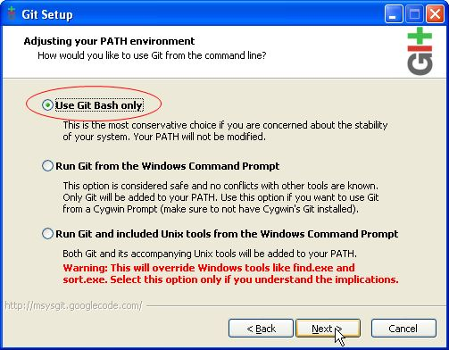
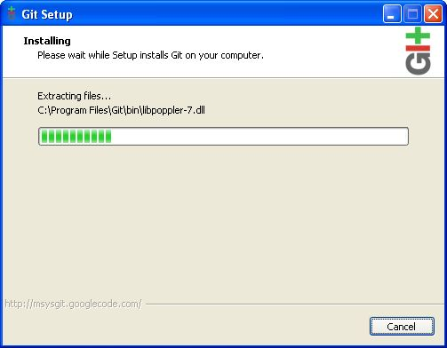

Setting up your development environment
=======================================

Risk-in-a-box is built in python and runs as a plugin in `QGIS
<http://qgis.org>`_.

Quick Installation Guide - Linux (Debian based)
-----------------------------------------------

These instructions are for setting up a development version on a Debian based linux system such as Ubuntu or Mint.

1. Goto the area where you do development, e.g cd ~/sandbox
2. wget https://raw.github.com/AIFDR/risk_in_a_box/master/scripts/riab-install
3. source ./riab-install

To verify that the installation works you can run the test suite from the
command line::

   cd risk_in_a_box
   make test

This will run all the regression tests and also highlight any code issues.
Note that first time the tests are run they will pull 250MB of test data from
our subversion repository (If asked for a password just hit Enter). See further
notes on running tests below.

To run the plugin start QGIS and enable it from the
:menuselection:`Plugins --> Manage Plugins` menu.

If this doesn't work see section towards the end of this document about dependencies and try to do a manual install.

Windows installation guide for developers
-----------------------------------------

Setup msysgit
.............

To check out the code for development, you first need to install a git client.
We cover msysgit here, but you can also use `tortoisegit <http://code.google.com/p/tortoisegit/downloads/list>`_
if you prefer (although the tortoise git procedure is not covered here.

To install msysgit (which is a command line git client), download the latest
version of the software from the `msysgit web site <http://code.google.com/p/msysgit/downloads/list>`_.
There is no need to get the 'full install' - just fetching the latest 'preview'
is good enough. For example at the time of writing I downloaded
:samp:`Git-1.7.9-preview20120201.exe`. The download is around 14mb in size.

Once the file is downloaded, run it and respnd to the installer prompts as
illustrated below:

.. figure::  ../../msysgit-step1.jpg
   :align:   center

.. figure::  ../../msysgit-step2.jpg
   :align:   center

.. figure::  ../../msysgit-step3.jpg
   :align:   center

.. figure::  ../../msysgit-step4.jpg
   :align:   center

.. figure::  ../../msysgit-step5.jpg
   :align:   center

.. figure::  ../../msysgit-step6.jpg
   :align:   center

.. figure::  ../../msysgit-step8.jpg
   :align:   center

Clone the repository
....................

First open a GIT bash prompt as illustrated below:

.. figure::  ../../msysgit-step10.jpg
   :align:   center

The repository can now be closed by issuing the commands listed below.::

   cd  /c/Documents\ and\ Settings/<your username>/

   mkdir -p .qgis/python/plugins

   cd .qgis/python/plugins/

   git clone https://<your username>@github.com/AIFDR/risk_in_a_box.git

.. note:: The items in angle brackets above should be replaced with your personal
   details as required.

When the final command above runs, you should see something like this in the
console when the clone process is completed::

   $ git clone https://timlinux@github.com/AIFDR/risk_in_a_box.git
   Cloning into 'risk_in_a_box'...
   remote: Counting objects: 5002, done.
   remote: Compressing objects: 100% (1526/1526), done.
   remote: Total 5002 (delta 3505), reused 4835 (delta 3338)
   Receiving objects: 100% (5002/5002), 2.38 MiB | 7 KiB/s, done.
   Resolving deltas: 100% (3505/3505), done.

Install an SVN client
.....................

The test data for Risk in a Box is hosted on an svn server, so to obtain it
you first need to install an SVN client. Start by downloading `this installer
<http://sourceforge.net/projects/win32svn/files/latest/download>`_ (it is
about 4.8mb to download).

Now run the installer, accepting the defaults options throughout.

Checkout the test data
......................

To check out the test data from svn, first open a command prompt (
:menuselection:`Start --> Run...` then type :kbd:`cmd.exe` and press
enter). Now navigate to the plugins directory and check out the
svn repository by typing the commands as listed below::

   cd "c:\Documents and Settings\user\.qgis\python\plugins\"
   svn co http://www.aifdr.org/svn/riab_test_data ../riab_test_data

You will be prompted for a username and password for svn - please
contect Ole Nielson for a log in account.

Install QGIS
............

Download the latest QGIS 'standalone' installer from http://download.qgis.org and
install it by running the installation wizard and accepting the defaults throughout.

After opening QGIS (:menuselection:`Start --> All Programs --> Quantum GIS Wroclaw --> Quantum GIS`)
you need to enable the plugin from the plugin menu by doing :menuselection:`Plugins --> Manage Plugins`
and then search for the Risk in a Box plugin in the list and enable it.

Windows Caveats
...............

Our primary development platform is Linux (specifically Ubuntu Linux). Some features
of the development environment - particularly the **Make** tools do not run on Windows.

As a work around, you can set up the eclipse IDE which is described below.

Development using Eclipse IDE with PyDev
----------------------------------------

.. note:: This is optional - you can use any environment you like for editing
   python, or even a simple text editor.

If you wish to use an IDE for development, please refer to
`this article <http://linfiniti.com/2011/12/remote-debugging-qgis-python-plugins-with-pydev/>`_
for detailed information on how to get the basic Eclipse with PyDev setup.

Configuring your Eclipse project
................................

The procedure for doing this is to do:
:menuselection:`File --> New --> Project...` and
then from the resulting dialog do :menuselection:`PyDev --> PyDev Project`.

In the resulting project dialog, set the following details:

* :guilabel:`Project name:` : :kbd:`risk_in_a_box`
* :guilabel:`Use default` : :kbd:`uncheck`
* :guilabel:`Directory` : :kbd:`/home/<your user name/.qgis/python/plugins/risk_in_a_box/`
* :guilabel:`Choose project type` : :kbd:`Python`
* :guilabel:`Grammar Version` : :kbd:`2.7`
* :guilabel:`Add project directory to PYTHONPATH?` : :kbd:`check`

At this point you should should click the link entitled 'Please configure an interpreter
in related preferences before continuing.' And on the resulting dialog do:

* :guilabel:`Python Interpreters: New...` : :kbd:`click this button`

In the dialog that appears do:

* :guilabel:`Interpreter Name` : :kbd:`System Python 2.7`
* :guilabel:`Interpreter Executable` : :kbd:`/usr/bin/python`
* :guilabel:`OK Button` : :kbd:`click this button`

Another dialog will appear. Tick the first entry in the list that points to
your::

   ~/.eclipse/org.eclipse.platform_3.7.0_155965261/plugins/org.python.pydev_2.3.0.2011121518/

(or simply click the 'Select All' button)

* :guilabel:`OK Button` : :kbd:`click this button`

You will be returned to the Python Interpreters list and should see an entry for
System Python 2.7 listed there. Now do in the *Libraries* tab:

* :guilabel:`Finish` : :kbd:`click this button`

Running Unit tests from the IDE
...............................

Python has very good integrated support for unit testing. The first thing
you should do after setting up the IDE project is to run the tests. You can run tests
in the following ways:

* For the entire risk_in_a_box package
* For individual sub packages (e.g. engine, gui, storage, impact_functions)
* for an individual test module within a package
* for an class within a test module
* for an individual method within a test class

You can view these individual entities by browsing and expanding nodes in the project
panel in the left of the IDE.

.. note:: If you run the test suite for the entire risk_in_a_box package, it will
    mistakenly treat the sphinx documentation conf.py (docs.source.conf) as a test
    and fail for that test. This is 'normal' and can be ignored.

Remote Debugging with Eclipse
.............................

For remote debugging, you should add pydevd to your PYTHONPATH before starting *QGIS*
for example (you will need to adjust these paths to match your system)::

	export PYTHONPATH=$PYTHONPATH:/home/timlinux/.eclipse/org.eclipse.platform_3.7.0_155965261/plugins/org.python.pydev.debug_2.3.0.2011121518/pysrc/

.. note::

   If you are running with remote debugging enabled, be sure to start the
   PyDev debug server first before launching the Risk-in-a-box QGIS plugin
   otherwise QGIS will likely crash when it can't find the debug server.

You will need to ensure that the PYTHONPATH containing your pydev package folder
is set before you launch QGIS - for example by adding the above line to your ~/.bashrc
or by making a small batch file containing the above export and then sourcing the file
before launching QGIS e.g.::

    source riab_paths.sh
    /usr/local/bin/qgis

Additional development environment notes
----------------------------------------

Dependencies
............

The Graphical User Interface components are built using
`PyQt4 <http://www.riverbankcomputing.co.uk/software/pyqt/intro>`_ and the QGIS
plugin API (useful resources: `the QGIS Python Cookbook
<http://qgis.org/pyqgis-cookbook/>`_ and `the QGIS C++ API documentation
<http://qgis.org/api/>`_).  As such it is helpful if you are familiar with these
technologies (python, Qt4, PyQt4, QGIS). In addition, the following are needed
on your machine in order to work effectively with the code base:

* git
* subversion
* pep8
* nosetests (with coverage plugin)
* python-numpy (for numerical computations)
* python-gdal (python bindings to underlying gis functionality)
* python-sphinx (compilation of documents)
* pyqt4-dev-tools (compiling ui and resources)
* qt4-doc (qt4 API documentation)

On an ubuntu system you can install these requirements using apt::

   sudo apt-get install git subversion pep8 python-nose python-coverage \
   python-gdal python-numpy python-sphinx pyqt4-dev-tools

In some cases these dependencies may already be on your system via installation
process you followed for QGIS.

Cloning the source code from git
................................

To develop on the plugin, you first need to copy it to your local system. If
you are a developer, the simplest way to do that is go to
`~/.qgis/python/plugins` and clone risk_in_a_box from our GitHub repository
page like this::

   git clone git://github.com/AIFDR/risk_in_a_box.git  (for read only)
   git clone git@github.com:AIFDR/risk_in_a_box.git    (to commit changes)

QGIS installed in a non-standard location
.........................................

For running unit tests that need QGIS, you may need to adjust *PYTHONPATH* and
*QGISPATH* if QGIS is running in a non standard location. For example with
QGIS built from source into /usr/local (and python bindings global install
option disabled), you could run these commands (or add them to your ~/.bashrc)::

	export QGISPATH=/usr/local
	export PYTHONPATH=$PYTHONPATH:/usr/local/share/qgis/python/

.. note:: The above can be set within Eclipse's project properties if you are
    running your tests using the PyDev IDE environment.

Adding risk_in_a_box to your python path:
.........................................

Lastly, you should add the riab plugin folder to your PYTHONPATH so that
package and module paths can be resolved correctly. E.g::

	export PYTHONPATH=$PYTHONPATH:${HOME}/.qgis/python/plugins/risk_in_a_box

Once again you could add this to your .bashrc or set it in Eclipse for
convenience if needed.

.. _running-tests-label:

Running tests
.............

You can run all tests (which includes code coverage reports and other
diagnostics) by doing this within the risk_in_a_box plugin folder::

	make test

You can also run individual tests using nose. For example to run the
riabclipper test you would do::

	nosetests -v gui.test_riabclipper

Setting up your windows environment for running tests
.....................................................

First you should create a custom shell launcher that will give you a python
shell environment using the python that comes bundled with QGIS. Save the 
following listing in <QGIS Install Dir>/bin/python-shell.bat::

   @echo off
   SET OSGEO4W_ROOT=C:\PROGRA~2\QUANTU~1
   call "%OSGEO4W_ROOT%"\bin\o4w_env.bat
   call "%OSGEO4W_ROOT%"\apps\grass\grass-6.4.2RC2\etc\env.bat
   @echo off
   SET GDAL_DRIVER_PATH=%OSGEO4W_ROOT%\bin\gdalplugins\1.8
   path %PATH%;%OSGEO4W_ROOT%\apps\qgis\bin;%OSGEO4W_ROOT%\apps\grass\grass-6.4.2RC2\lib
   rem pip and easyinstall will get added to this dir so add it to our path
   path %PATH%;"c:\Program Files (x86)\Quantum GIS Wroclaw\apps\Python25\Scripts\"
   set PYTHONPATH=%PYTHONPATH%;%OSGEO4W_ROOT%\\apps\\qgis\\python;%OSGEO4W_ROOT%\\apps\\Python25\\Lib\\site-packages
   set QGISPATH "C:\PROGRA~2\QUANTU~1\apps\qgis"
   start "Quantum GIS" /B "cmd.exe" %*

Now we need to install easy_setup so that we can install pip so that we can
install notetests. Download the script on 
`this page <http://pypi.python.org/pypi/setuptools#windows>`_ called ez_setup.py
and save it somewhere familiar e.g. :samp:`c:\temp`.

Next launch the shell (python-shell.bat) as administrator (by right clicking the
file and choosing run as administrator). Then from the command line, launch the 
ez_setup.py by typing this::

   python c:\temp\ez_setup.py

.. note:: You will need to launch the shell as administrator whenever you 
   need to install python packages by pypi.

Now in the same shell, use easy setup to install pip (make sure you have added
the QGIS scripts dir to your shell launchers path as described in the comments
of python-shell.bat)::
   
   easy_install pip

If the installation goes successfully, you should see output like this::

   Searching for pip
   Reading http://pypi.python.org/simple/pip/
   Reading http://pip.openplans.org
   Reading http://www.pip-installer.org
   Best match: pip 1.1
   Downloading http://pypi.python.org/packages/source/p/pip/pip-1.1.tar.gz#md5=62a9f08dd5dc69d76734568a6c040508
   Processing pip-1.1.tar.gz
   Running pip-1.1\setup.py -q bdist_egg --dist-dir c:\users\timsut~1\appdata\local
   \temp\easy_install--zkw-t\pip-1.1\egg-dist-tmp-mgb9he
   warning: no files found matching '*.html' under directory 'docs'
   warning: no previously-included files matching '*.txt' found under directory 'docs\_build'
   no previously-included directories found matching 'docs\_build\_sources'
   Adding pip 1.1 to easy-install.pth file
   Installing pip-script.py script to C:\PROGRA~2\QUANTU~1\apps\Python25\Scripts
   Installing pip.exe script to C:\PROGRA~2\QUANTU~1\apps\Python25\Scripts
   Installing pip.exe.manifest script to C:\PROGRA~2\QUANTU~1\apps\Python25\Scripts
   Installing pip-2.5-script.py script to C:\PROGRA~2\QUANTU~1\apps\Python25\Scripts
   Installing pip-2.5.exe script to C:\PROGRA~2\QUANTU~1\apps\Python25\Scripts
   Installing pip-2.5.exe.manifest script to C:\PROGRA~2\QUANTU~1\apps\Python25\Scripts
   
   Installed c:\progra~2\quantu~1\apps\python25\lib\site-packages\pip-1.1-py2.5.egg
   Processing dependencies for pip
   Finished processing dependencies for pip

Next you need to install nose and nose-cov::

   pip install nose nose-cov
   
Once they are installed, you can run the nose tests from windows by going to
the plugin directory (in your python-shell.bat shell session) and running::

   runtests.bat

Verifying your system path
^^^^^^^^^^^^^^^^^^^^^^^^^^

To verify your path, launch your python shell (by clicking the python-shell.bat)
and then start a python shell. Now enter the follow simple script::

   import sys
   for item in sys.path:
       print item

Which should produce output like this::

   C:\Program Files (x86)\Quantum GIS Wroclaw\bin
   C:\PROGRA~2\QUANTU~1\apps\qgis\python
   C:\PROGRA~2\QUANTU~1\apps\Python25\Lib\site-packages
   C:\Program Files (x86)\Quantum GIS Wroclaw\bin\python25.zip
   C:\PROGRA~2\QUANTU~1\apps\Python25\DLLs
   C:\PROGRA~2\QUANTU~1\apps\Python25\lib
   C:\PROGRA~2\QUANTU~1\apps\Python25\lib\plat-win
   C:\PROGRA~2\QUANTU~1\apps\Python25\lib\lib-tk
   C:\PROGRA~2\QUANTU~1\apps\Python25
   C:\PROGRA~2\QUANTU~1\apps\Python25\lib\site-packages\win32
   C:\PROGRA~2\QUANTU~1\apps\Python25\lib\site-packages\win32\lib
   C:\PROGRA~2\QUANTU~1\apps\Python25\lib\site-packages\Pythonwin
   C:\PROGRA~2\QUANTU~1\apps\Python25\lib\site-packages\wx-2.8-msw-unicode

It is particularly the second and third lines that you need to have in place
so that the QGIS libs can found::

   from qgis.core import *
   exit()

Assuming you get no error messages, you have a functional python command
line environment which you can use to test QGIS functionality with.

