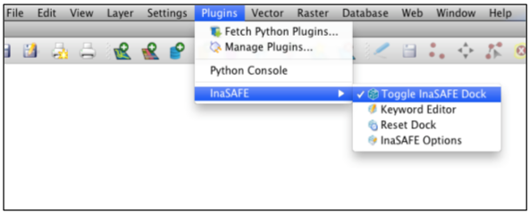
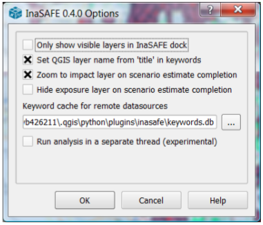
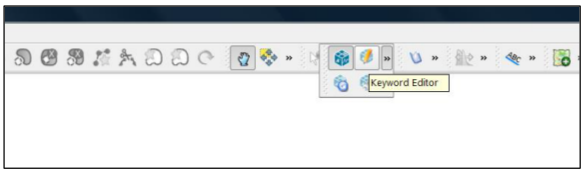
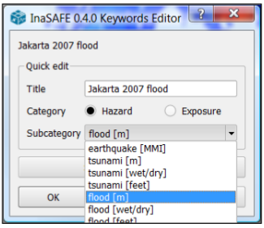
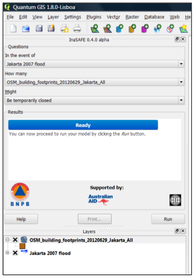
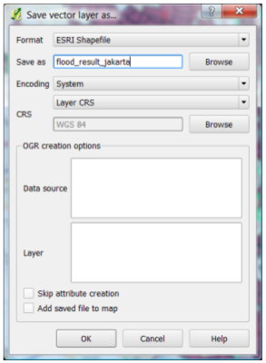

=================================================================
InaSAFE Tutorial
=================================================================

Overview
--------

Description
...........

InaSAFE is a plugin for QGIS software. It aims to produce realistic natural
hazard impact scenarios for better planning, preparedness and response
activities, using hazard and exposure geographic data. A user’s manual
developed by Ole Moeller Nielsen and Tim Sutton complements this short training
material. During this training, you will explore the different components of
InaSAFE plugin and their usage for an easy-to-use risk and impact scenarios
assessments. A data sample will be provided with the present material to give
you the ability to learn how to manipulate data in InaSAFE, what the
requirements of the data are and what kind of results you can expect out of the
data.

Prerequisites
.............

This training is designed for those with a basic or intermediate knowledge of
GIS, who wants to integrate scientific-based risk impact scenario in their
decision-making. Since the tool is a QGIS plugin, some knowledge of the QGIS
environment will help, but not required.

Goals
.....

After the training, you will be able to:

* install a plugin in QGIS and understand its usage for spatial analysis
* understand what are hazard and exposure data and how they can be used to
  estimate impacts
* learn how to prepare the data to be able to use it in InaSAFE
* perform a risk scenario using flood and earthquake data
* analyze estimated impact of the example scenarios
* learn how to print and save the result of the simulation

Software Requirements
.....................

To complete the exercise, you need a standard computer with at least 4GB of RAM
running Windows, Linux or Mac OS X. You also need to install the following on
your computer:

* QGIS
* InaSAFE plugin.

Reference
.........

“InaSAFE Documentation, Release 0.4.0-alpha”, Ole Moeller Nielsen & Tim Sutton,
June 2012.  For more information, please visit `www.inasafe.org <http://inasafe.org>`_.

Installation
------------

Install QGIS
............

You need QGIS version 1.7 or newer.

You can download the software from http://download.qgis.org.

Install InaSAFE Plugin
......................

Option 1: From QGIS Repository:
^^^^^^^^^^^^^^^^^^^^^^^^^^^^^^^

To install the InaSAFE, use the plugin manager in QGIS:

:menuselection:`Plugins --> Fetch Python Plugins`
Then search for ‘InaSAFE‘, select it and click the install button. The plugin
will now be added to your plugins menu.

Option 2: Manual Installation:
^^^^^^^^^^^^^^^^^^^^^^^^^^^^^^

To install the InaSAFE plugin, go to
https://github.com/AIFDR/inasafe/downloads.

The application package comes as a zip file. Please select the most updated
version.

Extract the zip file into the QGIS directory :file:`C:\Users\<your
username>\.qgis\python\plugins`.

After extracting the plugin, it should be available as
:file:`C:\Users\<yourusername>\.qgis\python\plugins\inasafe`

Mac and Linux users need to follow the same procedure but instead the plugin
directory will be under your :file:`$HOME` directory.

Enable InaSAFE Plugin in QGIS
.............................

Once the plugin is extracted in QGIS plugin directory, start QGIS and enable it
from the plugin manager.  To do this, open **Manage Plugins** from the
**Plugins** menu on the menu toolbar.

.. image:: ../static/tutorial/001.png
   :align: center

A pop-up window that lists all available plugins in your current QGIS project
will appear. Type **InaSAFE** in the filter box. You should see the InaSAFE
plugin appear in the list. Now **tick the checkbox** next to it to enable the
plugin.

.. image:: ../static/tutorial/002.png
   :align: center

The plugin now will be added to your **Plugins** menu.

Now you will need to add the INASAFE panel on your QGIS interface. For that,
select **Toggle Inasafe Dock** in the INASAFE plugin scroll list.

The InaSAFE dock panel will then appear on the left of your QGIS window.

.. image:: ../static/tutorial/004.png
   :align: center

It is the main way to interact with the tools that are provided in InaSAFE.

Also, an InaSAFE icon will appear on the QGIS toolbar.

.. image:: ../static/tutorial/005.png
   :align: center

Using InaSAFE
-------------

InaSAFE Options
...............

The InaSAFE plugin provides an options dialog which allows you to define
various options relating to how InaSAFE will behave. The options dialog can be
launched by clicking on the InaSAFE plugin toolbar’s options icon (as shown
below) or from QGIS :menuselection:`Plugins --> InaSAFE --> InaSAFE Options`.

.. image:: ../static/tutorial/006.png
   :align: center

Then the dialog will appear, looking something like this:

.. note:: You can click on the Help button at any time and it will open the
   help documentation browser to this page.

The following options are available on the Options Dialog:

* **Only show visible layers in the InaSAFE dock:** This option will determine
  whether (when unchecked) all hazard, exposure and impact layers should be
  listed in the InaSAFE dock’s combo boxes; or (when checked) only visible
  layers.
* **Set QGIS layer name from ‘title’ in keywords:** This option will (when
  enabled) cause QGIS to name layers in the Layers tree, using the title
  keyword in the layer’s keywords file. If the layer has no ‘title’ in its
  keywords, or it has no keywords at all, the normal QGIS behavior for naming
  layers will apply.
* **Zoom to impact layer on scenario estimate completion:** This option will
  cause the map view to zoom in/out in order to completely contain the InaSAFE
  impact scenario map output when an analysis is completed.
* **Hide exposure layer on scenario estimate completion:** This option will
  cause QGIS to turn off the exposure layer used when InaSAFE completes the
  current analysis. You can re-enable the layer visibility again by checking
  its checkbox in the legend.
* **Keyword cache for remote datasources:** This option is used to determine
  where keywords are stored for datasets where it is not possible to write them
  into a .keywords file. See Keywords System for more information on the
  keywords system.
* **Run analysis in separate thread (experimental):** This option cause the
  analysis to be run in its own thread.

**WARNING!**

* It is not recommended to use the threaded implementation at this time. For
  this reason it is disabled by default.
* Pressing Cancel at any time will close the options dialog and any changes
  made will not be applied.
* Pressing Ok at any time will close the options dialog and any changes made
  will be applied immediately.
* The exact button order shown on this dialog may differ depending on your
  operating system or desktop environment.

Adjust Projection
.................

Before continuing we need to turn one more QGIS functionality on, to enable all
data layers display in one projection (no matter what their projection).

For that, go to QGIS **Settings/Project Properties.**

.. image:: ../static/tutorial/008.png
   :align: center

Click on **Coordinate Reference System (CRS)** tab in the new dialog box. Tick
the **Enable ‘on the fly’ CRS transformation** box. And then **OK.**

.. image:: ../static/tutorial/009.png
   :align: center

Now, any data layer that we will integrate into our project will be adjusted on
the same coordinate.

Exploring InaSAFE Plugin
........................

You can drag and drop the dock panel to reposition it in the user interface.
For example, dragging the panel towards the right margin of the QGIS
application will dock it to the right side of the screen.

Depending on your preference you could show the **Layer** and **InaSAFE** panel
at the same time.

.. image:: ../static/tutorial/010.png
   :align: center

Or have the **Layer** and **InaSAFE** panels in a tab systems.

.. image:: ../static/tutorial/011.png
   :align: center

Or for more convenience, having them on top of each other.

.. image:: ../static/tutorial/012.png
   :align: center

The INASAFE panel contains 3 sections: **Questions, Results** and **Buttons.**
We will explore those sections one by one.

The Questions Section
.....................

The intention of InaSAFE is to make it really simple and easy to perform your
impact analysis. The Questions area provides a simple way for you to formulate
what it is you want to find out? All questions are formulated in the form:

*In the event of* **[hazard]** *how many* **[exposure]** *might* **[impact].**

For example:
“In the event of a **flood** how many **buildings** might be **closed**?”

Let’s practice this exercise.

In order to answer such question, InaSAFE developers have built a number of
impact functions that cover risk scenarios such as flood, tsunami, volcanic ash
fall, earthquake and so on. In our case, we will use the flood impact function.

To answer our question “In the event of a flood, how many buildings might be
closed”, we need to complete all the areas in the Questions section: hazard,
exposure, impact.

Hazard
......

Hazard is the physical event that creates the risk.

A hazard (in **the event of**) may be represented as a raster layer or as an
area (polygon). For example:

* **Raster:** where each pixel in the raster represents the current flood depth
  following an inundation event.
* **Polygon:** where it has been identified that flood has existed in that area
  (this will not have depth related information)

For our exercise, we will use an example from Jakarta, Indonesia. Those data
are already installed on your computer at :file:`C:\Users\<your
username>\desktop\inasafe_data`. If they are not, you can load the data on your
desktop using the thumb drive distributed with this material.

The inasafe_data package contains various geographic data that we will use
along the workshop.

Now, we will add the hazard layer in the INASAFE dock. For that, we need to add
the hazard layer from QGIS first. The flood layer is in a raster format, so we
will go to the QGIS menu, click on **Layer,** and select **Add Raster Layer.**

.. image:: ../static/tutorial/013.png
   :align: center

Once you click on that, a pop-up window will appear where you will have to
fetch your flood data.  Please select the
**“Flood_Design_Depth_Jakarta_geographic.asc”** file from the hazard folder.
This is a raster data (in ASCII format) that represents flooding depth in the
Jakarta province. The display name is **Jakarta 2007 flood with dredging.**

You will notice that the layer filled automatically the “hazard” area in the
InaSAFE dock panel. There are two important things to note when **uploading
data** in InaSAFE.

* Data should follow a keyword metadata system that allows InaSAFE to determine
  if the layer is a hazard or if it is an exposure.
* The area of analysis should overlap.

Adding keyword metadata
.......................

You may be wondering how the InaSAFE plugin determines whether a layer should
be listed in the “In the event of” “How many” combo boxes? The plugin relies on
simple keyword metadata to be associated with each layer (*The keyword system
is described in detail in the user’s manual under Keywords System*). Each layer
that has a keyword allocating it’s category to hazard will be listed in the “In
the event of” combo. Similarly, a category of exposure in the keywords for a
layer will result in it being listed under the “How many” combo. InaSAFE uses
the combination of category, subcategory, units and datatype keywords to
determine which impact functions will be listed in the “Might” combo.

In our exercise, the keywords were already created, so the data could fill
automatically the “In the event of” “How many combo” boxes. If the keywords
were not created in advance, then we will create them by following one of the
two steps:

Go to the Inasafe tools on the toolbar, click on the **Keyword Editor** icon.

Or, open the **Plugin** menu on QGIS toolbar, click on **InaSAFE,** then click
on the **Keyword Editor** in the scroll list.

.. image:: ../static/tutorial/016.png
   :align: center

Once you click on the Keyword Editor, a dialog box containing the flood data
will be prompted. Since the flood data is a hazard layer, pinpoint the
**Hazard** Category. In the Subcategory, we will choose flood [m] because our
data represents depth of flood in Jakarta in meter unit.

Then click **OK.**

Now the data follow the keyword rule, and can be used in the InaSAFE function.

Exposure
........

Exposure is the sum of assets and population that are at risks.

An exposure (How **many**) layer could be represented, for example, as vector
polygon data representing building outlines, or a raster outline where each
pixel represents the number of people resident in that cell.

Now, we will add the exposure layer in our InaSAFE project. For that, we need
to add the exposure layer to QGIS first. For our exercise, we will use the
OpenStreetMap (OSM) data that represents buildings in Jakarta Province.

The OSM building layer is in a vector format, so we will go to the QGIS menu
toolbar, click on **Layer,** and select **Add Vector Layer.**

.. image:: ../static/tutorial/018.png
   :align: center

Once you click on that, a pop-up window will appear where you will have to
fetch your OSM buildings data.

.. image:: ../static/tutorial/019.png
   :align: center

Please select the “OSM_building_footprints_20120629_Jakarta_All.shp” file from
the exposure folder.

Click **Open.**

This is a vector data (in ESRI SHP format) that represents buildings data
gathered by the Jakarta province community using the OSM participatory tools.
The display name is “OSM **buildings** ”.

Please note that the exposure data should follow the same **keyword system**
that we explained earlier for the hazard data.

In our case, the keyword was already created. If the keyword was not created in
advance, then we will create it by using the **Keyword Editor** in InaSAFE from
the toolbar or from the **Plugins** menu.

Go to the **Plugin menu** on QGIS toolbar. Click on **InaSAFE.** Then, click on
the **Keyword Editor** in the dialog box. Pinpoint the **Exposure** category.
Choose **building [OSM]** in the **Subcategory** scroll box. Click **OK.**

.. image:: ../static/tutorial/019.png
   :align: center

Now our OSM building exposure data can be used in INASAFE and was automatically
entered in the **How many box** of the INASAFE dock panel.

Also note that the 2 datasets are sitting on top of one another even though
they are different projections.

Impact Analysis
...............

The impact function (**Might**) will spatially combine the hazard and exposure
input layers in order to postulate what the impacts of the hazard will be on
the exposure infrastructure or people. By selecting a combination from the “In
the event of” and “How many” combo boxes, an appropriate set of impact
functions will be listed in the “Might” combo box.

Impact scenarios are predefined depending on what the decision-maker is looking
for. For our flood analysis in Jakarta, we only have on predefined impact
function which asks: **In case of flood event, how many buildings might be
temporarily closed?** As we see on the previous step, this is filled
automatically by default in the InaSAFE panel dock as soon as the hazard
[flood] and exposure [buildings] layers are entered correctly.

The Results section
...................

Now that we have our two input layers and that we know what impacts we would
like to assess, click on the **Run** button at the bottom to start the impact
analysis. At the end of the process, figures will be shown in the **Results**
section, a new layer will be added in the QGIS layer panel representing the
result of the impact function, and the map will differentiate affected and
non-affected building.

.. image:: ../static/tutorial/021.png
   :align: center

.. image:: ../static/tutorial/022.png
   :align: center

The result shows **total number of buildings** and the **number of buildings
that might be temporarily closed** in the event of a flood. Also, there is an
**Action Checklist** where the question: *Are the critical facilities still
open?* And a **Note** description explaining that buildings are said flooded
when the flood level exceeds 1m.

Enhancing the Map Output
........................

The final output map can be enhanced using cartographic functions in QGIS.
Styles can be changed, background layer or other relevant layers can be added,
layout can be changed using the **Print Composer** in QGIS.

If you would like to add openlayer background to your map, all you need to do
is add a new plugin called **OpenLayer Plugin** in QGIS and follow the same
steps as we did to acquire the InaSAFE plugin.

You can download the plugin from the website
http://build.sourcepole.ch/qgis/plugins.xml, and put it in the QGIS plugin
directory :file:`C:\Users\<your username>\.qgis\python\plugins`.

To enable the OpenLayer plugin, go to the QGIS **Plugin Manager** and select
**OpenLayers Plugin.**

Once installed you should be able to use background imagery and tiles from
google, yahoo, bing and openstreetmap.

.. image:: ../static/tutorial/023.png
   :align: center

For our exercise, let’s add the Google Satellite view to our map as a
background. Make sure that the background is not on top of the other active
layers.

Print Results
.............

The data shown on the screen can be saved into a **PDF file** by clicking on
**Print** at the bottom of the InaSAFE panel. The PDF file contains then the
**legend** for the result of the impact assessment, the **map** created and a
**table** summarizing the results from the impact function.

However, any change that you want to make into the final map document should be
done **before** clicking on the **Print** button of the INASAFE dock panel. The
print should be only use once the data is exactly as you want it to be
displayed.

.. image:: ../static/tutorial/024.png
   :align: center

Save results and QGIS project
.............................

The output layer result of the assessment can be saved by right clicking on the
layer.

.. image:: ../static/tutorial/025.png
   :align: center

Then **Save As** a shapefile or a raster. However the keywords and statistics
do not get saved.

You can also save the project under QGIS so that you can access your current
window view anytime needed. For that, go to the **File** menu on QGIS toolbar.
Click on **Save Project As.**

.. image:: ../static/tutorial/027.png
   :align: center

Give a name to the project and put it in the directory you want to store your
work. Then click on **Save.**

.. image:: ../static/tutorial/028.png
   :align: center

Now that the project is saved under QGIS, you can go back to your work anytime
you need. However, the statistical data will be lost whenever the project is
closed. To get the data back, you will need to redo the impact analysis process
we described above from **Run.**

The impact assessment can also be replicated for flood zone areas; the only
change is to add the layer as a vector and using keyword flood (wet/dry).

Go to QGIS **Layer/Add Vector Layer.**

.. image:: ../static/tutorial/029.png
   :align: center

Add the **Jakarta_RW_2007flood.shp**

.. image:: ../static/tutorial/030.png
   :align: center

The impact functions can also be modified to pull out certain attributes from
the input layers, in this case it can tease out the breakup of building types.

.. image:: ../static/tutorial/031.png
   :align: center

.. note:: The flood zone areas were derived from sub-village administration
   boundaries and defined as areas that were flooded in the last large flood
   in Jakarta in 2007.

International Language
----------------------

Both QGIS and InaSAFE come with multi-lingual support.

Go to QGIS Settings/options.

.. image:: ../static/tutorial/032.png
   :align: center

Go to the Locale tab, and click to **Override system locale.** You must close
the QGIS project and reopen for the language to take hold.

.. image:: ../static/tutorial/033.png
   :align: center

At this point InaSAFE has only been translated into Indonesian, however there
is a framework that can support all languages outlined in QGIS.

Thank You
---------

THANK YOU FOR YOUR PARTICIPATION! :)

Let us know how you enjoyed the training and what you think about the tool.

THE INASAFE TEAM

* Indonesian Disaster Management Agency (BNPB)
* AusAID - Australia-Indonesia Facility for Disaster Reduction
* World Bank - Global Facility for Disaster Reduction and Recovery

