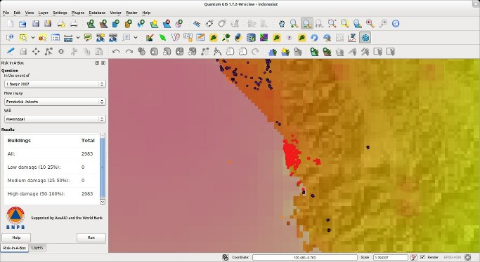

===========================
|project_name| - QGIS Plugin
===========================

This is the project: |project_name| - QGIS

The latest source code is available in https://github.com/AIFDR/inasafe
which contains modules for risk calculations, gis functionality and functions for impact modelling.

For more information about |project_name| please look at
the documentation at http://risk-in-a-box.readthedocs.org

|project_name| - QGis web site: http://aifdr.github.com/inasafe

========================
Quick Installation Guide
========================

.. note::

  |project_name| is a plugin for `Quantum GIS <http://qgis.org>`_ (QGIS), so
  QGIS must be installed first.

To install the |project_name|, use the plugin manager in QGIS::

  Plugins -> Fetch Python Plugins

Then search for '|project_name|', select it and click the install button.
The plugin will now be added to your plugins menu.

-------------------
System Requirements
-------------------

 - A standard PC with at least 4GB of RAM running Windows, Linux or Mac OS X
 - The Open Source Geographic Information System QGIS (http://www.qgis.org).
   |project_name| requires QGIS version 1.7 or newer.

===========
Limitations
===========

|project_name| is a very new project. The current code development started
in earnest in March 2011 and there is still much to be done.
However, we work on the philosophy that stakeholders should have access
to the development and source code from the very beginning and invite
comments, suggestions and contributions.

As such, |project_name| currently has some major limitations, including

 * Hazard layers must be provided as raster data
 * Exposure data must be either raster data or vector data but only
   point, line and polygon types are supported.
 * All data must be provided in WGS84 geographic coordinates
 * Neither AIFDR nor GFDRR take any responsibility for the correctness of
   outputs from |project_name| or decisions derived as a consequence

