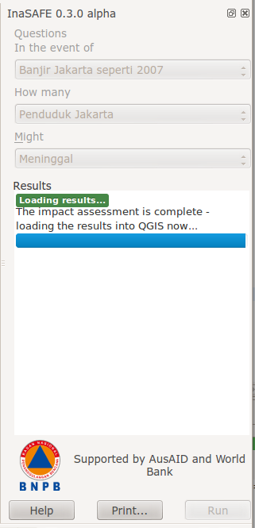
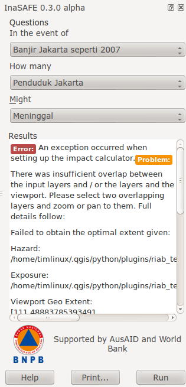

===============================
Using the |project_name| Plugin
===============================

This document describes the useage of the |project_name| 'dock panel' - which
is the main interface for running risk scenarios within the Quantum GIS
environment.

.. note:: In order to use the |project_name| tool effectively, you should 
   probably also read the :doc:`keywords` and :doc:`impact_functions`
   documentation before you get started.

The |project_name| Dock panel is the main way to interact with the tools that
are provided in |project_name|. After you have installed the |project_name|
plugin, the dock panel will automatically load in QGIS, appearing on the left
hand side of the screen.

.. figure:: ../static/inasafe-dock-panel.png
   :align:   center

You can drag and drop the dock panel to reposition it in the user interface.
For example, dragging the panel towards the right margin of the QGIS application
will dock it to the right side of the screen.

.. figure:: ../static/docked-right.png
   :align:   center

There are 3 main areas to the panel:

* the :guilabel:`Questions` area
* the :guilabel:`Results` area
* the buttons area

At any time you can obtain help in |project_name| by clicking on the
:guilabel:`help` buttons provided on each dock and dialog.

The Questions Area
------------------

The intention of InaSAFE is to make it really simple and easy to perform
your impact analysis. The question area provides a simple way for you to
formulate what it is you want to find out? All questions are formulated in 
the form:

   If [**hazard**] how many [**exposure**] might [**impact**].

For example:

   If **there is a flood** how many **schools** might **be closed**.

In order to answer such questions, the |project_name| developers have built
a number of **impact functions** that cover scenarios such as flood,
tsunami, volcanic ash fall, earthquake and so on. You can read our impact
function documentation to find out more information about the various
:doc:`impact_functions` implemented.

The formulation of these questions if carried out by loading layers into QGIS
that represent either **hazard** or **exposure** scenarious. 

* A **hazard** (:guilabel:`In the event of`) may be represented as, for example,
  a raster layer in QGIS where each pixel in the raster represents the current
  flood depth following an inundation event.
* An **exposure** (:guilabel:`How many`) layer could be represented, for
  example, as vector polygon data representing building outlines, or a raster
  outline where each pixel represents the number of people resident in that
  cell.

The **impact function** (:guilabel:`Might`) will combine these two input layers
in a mathematical model in order to postulate what the impacts of the hazard
will be on the exposure infrastructure or people.

By selecting a combination from the :guilabel:`In the event of` and
:guilabel:`How many` combo boxes, an appropriate set of impact functions will
be listed in the :guilabel:`Might` combo box.

You may be wondering how the |project_name| plugin determines whether a layer
should be listed in the :guilabel:`In the event of` or :guilabel:`How many`
combo boxes? The plugin relies on simple keyword metadata to be associated
with each layer. The keyword system is described in detail in :doc:`keywords`.
Each layer that has a keyword allocating it's **category** to **hazard** will
be listed in the :guilabel:`In the event of` combo. Similarly, a **category**
of **exposure** in the keywords for a layer will result in it being listed
under the :guilabel:`How many` combo.

|project_name| uses the combination of **category**, **subcategory**, **units**
and **datatype** keywords to determine which **impact functions** will be
listed in the :guilabel:`Might` combo.

The results area
----------------

The :guilabel:`Results` area is used to display various useful feedback items
to the user. Once an impact scenario has been run (see next section below),
a summary table will be shown.

.. figure:: ../static/scenario-results.png
   :align:   center

If you select an **impact layer** (i.e. a layer that was produced using an
|project_name| impact function), in the QGIS layers list, this summary will
also be displayed in the results area.

When you select a **hazard** or **exposure** layer in the QGIS layers list,
the keywords for that layer will be shown in the :guilabel:`Results` area,
making it easy to understand what metadata exists for that layer.

.. figure:: ../static/keywords-for-active-layer.png
   :align:   center

The :guilabel:`Results` area is also used to display status information. For
example, when a suitable combination of **hazard**
(:guilabel:`In the event of`), **exposure** (:guilabel:`How many`) and 
**impact function** (:guilabel:`In the event of`) are selected, the results
area will be updated to indicate that you can proceed to run the impact
scenario calculation.

.. figure:: ../static/status-ready.png
   :align:   center

While a scenario is being computed, the :guilabel:`Results` area displays the
current progress of the analysis.

Finally, the :guilabel:`Results` area is also used to display any error
messages so that the user is informed as to what went wrong and why.

.. note:: At the bottom of error display you may see button like this: 
   .. image:: ../../toggle-traceback.png If you click on this button, it
   will display a box which will contain useful diagnostic information which 
   can be submitted as part of a bug report if you think the error was 
   incorrect.

The buttons area
----------------

The buttons area contains three buttons:

* :guilabel:`Help` - click on this if you need context help, such as the
  document you are reading right now!
* :guilabel:`Print...` - click on this if you wish to create a pdf of your
  impact scenarion project. An **impact layer** must be active before the
  :guilabel:`Print...` button will be enabled.
* :guilabel:`Run` - if the combination of options in the :guilabel:`Questions`
  area's combo boxes will allow you to run a scenario, this button is enabled.

Data conversions when running a scenario
----------------------------------------

When running a scenario, the data being used needs to be processed into a state
where it is acceptible for use by the impact function. In particular it should
be noted that:

* Remote datasets will be copied locally before processing.
* All datasets will be clipped to the intersection of the **hazard** layer,
  the **exposure** layer and the current view extents.
* All clipped datasets will be converted (reprojected) to Geographic (EPSG:4326)
  coordinate reference system before analysis.

