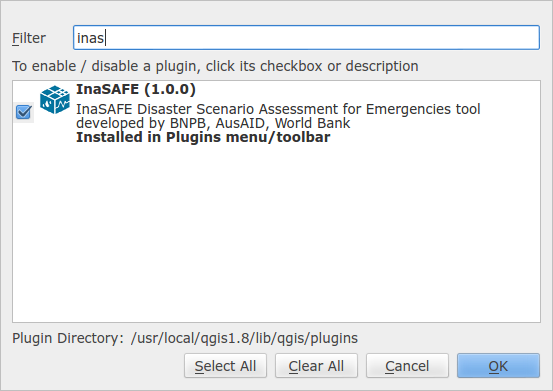

==================
Installing InaSAFE
==================

.. note::
   |project_name| is a plugin for `Quantum GIS <http://qgis.org>`_ (QGIS), so
   QGIS must be installed first.

Via QGIS Python Plugin Repository
---------------------------------

To install the |project_name|, use the plugin manager in QGIS::

  Plugins -> Fetch Python Plugins

Then search for '|project_name|', select it and click the install button.
The plugin will now be added to your plugins menu.

From Zip Archive
----------------

.. warning:: This installation method is not recommended unless you have no
   internet access or wish to use a specific version of InaSAFE. Please
   install using the plugin repository described above rather.

We make regular releases of the InaSAFE plugin and they are available at
https://github.com/AIFDR/inasafe/downloads. Simply choose the most recent (i.e.
the one with the largest version number) and save it to your hard disk.

Now extract the zip file into the QGIS plugins directory. Under windows the
plugins directory is under
:file:`c:\\Users\\<your username>\\.qgis\\python\\plugins`.

After extracting the plugin, it should be available as
:file:`c:\\Users\\<your username>\\.qgis\\python\\plugins\\inasafe\\`.

Mac and Linux users need to follow the same procedure but instead the plugin
directory will be under your $HOME directory.

Once the plugin is extracted, start QGIS and enable it from the plugin manager.
To do this open the plugin manager (:menuselection:`Plugins --> Manage plugins...`)
and type :samp:`insafe` into the filter box. You should see the InaSAFE plugin
appear in the list. Now tick the checkbox next to it to enable the plugin.

System Requirements
-------------------

 - A standard PC with at least 4GB of RAM running Windows, Linux or Mac OS X
 - The Open Source Geographic Information System QGIS (http://www.qgis.org).
   InaSAFE requires QGIS version 1.7 or newer.
