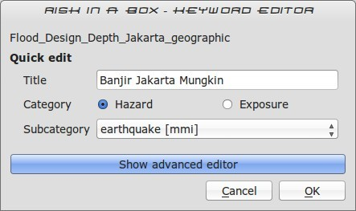
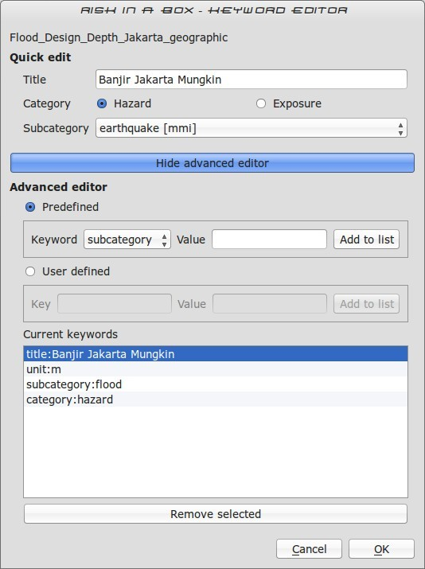

===============
Keywords System
===============

This document describes the purpose and usage of the Risk in a Box *keywords*
system.

Purpose
-------

The keywords system is used by the :doc:`impact_functions` to determine the
nature of the input layers that have been passed to them.

Each input GIS dataset used by Risk in a Box needs to have an accompanying
keywords file. The purpose of the keywords file is to provide additional
metadata needed by the impact functions. For example, the keywords file
will indicate whether a given dataset should be treated as a *hazard* or an
*impact* layer. It is also used to indicate the context of the layer (e.g. "it's
a *flood* layer, it's an *earthquake* layer).

By convention and expectation, the keywords file should be named with the
same base name of the GIS datasource it accompanies. For example a flood
dataset saved as::

   c:\gisdata\flood.tif

Would need to have an accompanying keywords file saved as::

   c:\gisdata\flood.keywords

.. note:: We recommend to **avoid using spaces** in your file
   names and file paths!

The Risk in a Box QGIS plugin provides an editor for these keywords.
The purpose of this document is to describe the keywords editor and to
provide guidelines as to the use of keywords.

.. note:: Currently keywords are not validated by the library. This means
   if you for example misspell a keyword, use the wrong letter case (e.g. upper
   case instead of lower case) or provide the wrong keyword for the context
   (e.g. provide a subcategory of flood to an exposure category), the system
   will not be able to determine what to do with the file. For that reason
   you should follow the guidelines below carefully to ensure you have entered
   your keywords correctly.

Guidelines
----------

In this section we lay out the guidelines for keyword usage.

Category
........

Every dataset should have a category assigned to it. Category should be
written in lower case.

.. table::

   ========  ================
     Key      Allowed Values
   ========  ================
   category  hazard
   category  exposure
   ========  ================

Example keywords file entry::

  category: hazard

Subcategory
...........

The selection of a subcategory value is dependent on the category:

Valid subcategories for category 'hazard':

.. table::

   ============  ================
     Key         Allowed Values
   ============  ================
   subcategory      tsunami
   subcategory      flood
   subcategory      tephra
   ============  ================

Where tephra is volcanic ashfall.

Valid subcategories for category 'exposure':

.. table::

   ============  ================
     Key         Allowed Values
   ============  ================
   exposure      population
   exposure      building
   exposure      roads
   ============  ================

Example keywords file entry::

  category: hazard
  subcategory: flood

Units
.....

The units keyword is only valid in the context of 'hazard' layers, and is
used to indicate the metric or imperial units represented by each data entity
(a grid cell or a vector feature) in the hazard layer. Example keywords file
entry:

  category: hazard
  subcategory: flood
  units: m

In the above case there is a soft constraint to use a value for units of m,
feet or wet/dry as defined by the table below because the subcategory is 'flood'
. The following are the allowed units which are dependent on the subcategory
defined.

Valid subcategories for subcategory 'tsunami' or subcategory 'flood':

.. table::

   ============  ================
     Key         Allowed Values
   ============  ================
   units         m
   units         wet/dry
   units         feet
   ============  ================

In the case where the units are m (meters) or feet, the input dataset should be
a raster layer where each cell in the raster represents a depth in the units
specified.

In the case of wet/dry, the input dataset needs to be a vector polygon layer.
Any area that is inside a polygon is considered 'wet' and any area outside of
a polygon is considered to be 'dry'.

Valid subcategories for subcategory 'volcano'

.. table::

   ============  ================
     Key         Allowed Values
   ============  ================
   units         kg2/m2
   ============  ================

In this case the dataset should be a raster layer where each cell represents
the kilograms per meters squared of ash fall on that cell.

.. note:: 'units' and 'datatype' (described below) should be considered to
   be mutually exclusive - i.e. they should not both be present in any given
   keywords file.

Datatype
........

The datatype keyword is specific to exposure layers and represents the datatype
of people, infrastructure etc. within a given area.

Valid densities for different subcategories

.. table::

   ============ ============== =====================
   Subcategory  Key            Allowed Values
   ============ ============== =====================
   population    datatype        count
   population    datatype        density
   building      datatype        osm
   building      datatype        sigab
   building      datatype        other
   roads         datatype        not used for roads
   ============ ============== =====================

Assumptions
-----------

The following assumptions are made about keywords, which may or may not be
programmatically enforced by the RIAB library and GUI:

* There should only be **one keyword for a given key** in the keywords file
* Switching from hazard to exposure will clear parts of the GUI since in
  general most keywords are category dependent. In particular, selecting
  **'hazard'** will remove the **'datatype'** key/value pair, and selecting
  **'exposure'** will remove the **'units'** key value pair.
* Keywords for **category** are **enforced** to be one of 'hazard' or
  'exposure' by the GUI.
* All keywords and values should be in **lower case**, **without spaces**
  with the exception of 'Title' whose value may contain both spaces and
  mixed case letters.
* Keys and values should **not contain colons**. In the keyword editor, any
  colons will be replaced with a full stop character.
* All other Keywords and values that do not fit the above domain lists may be
  used but they may produce undesired results.

The keywords editor graphical user interface
--------------------------------------------

The graphical user interface for keyword editing is divided into two parts:

1.) **Minimal mode**: In this mode, only following options are provided:

   * **Title** - a 'friendly' name for the dataset which will be displayed in
     reports, the user interface and so on.
   * **Category** - A mandatory choice between 'hazard' and 'exposure'.
   * **Subcategory** - An amalgamated subcategory/units picklist
     (in the case of hazard) or amalgamated subcategory/datatype (
     in the case of exposure). In this case, the secondary characteristic (
     units or datatype) are shown in square brackets after the subcategory
     name e.g. :samp:`flood [m]` is used for subcategory 'flood', units 'm'.

An example of the keywords editor in minimal mode is shown below.

2) **Advanced mode**: In this mode several extra options are provided in
  addition to the minimal mode options. Unlike minimal mode, in advanced mode
  only basic validation is performed and the user is given more flexibility to
  manually define and remove key/value pairs. Three sections are provided for
  this:

  * **Predefined** - In this section, the user selects from a constrained list
    of keywords, enters a free-form value and then adds the key/value pair to
    the keywords list (see below).
  * **User defined** - In this section, there is no constraint on the keywords
    entered - any single lower case word will be accepted for both the key and
    the value components.
  * **Current keywords** - In this area a complete list of all the keywords
    for the dataset are displayed. The keywords list here is updated when any
    changes are made in both the simple and advanced mode editors. It is also
    possible in this area to manually remove unwanted keywords using the 'remove
    selected' button. Multiple keywords can be removed in a single operation
    by :kbd:`Control-clicking` on multiple keyword entries in the current
    keyword list and then clicking :guilabel:`Remove selected`

An example of the keywords editor in advanced mode is shown below.

Invoking the keywords editor
----------------------------

The keyword editor can easily be invoked by selecting any layer in the
QGIS layers list, and then using the plugin menu to start the editor
(:menuselection:`Plugins --> Risk in a Box --> Keyword Editor`).
Alternatively, you may use the keywords editor icon on the
plugins toolbar as illustrated below.

 XXXX Add screenshot here xxxxxxx

Saving your edits
-----------------

To save your keyword edits, simply press the :guilabel:`OK` button and the
.keywords file will be written to disk.

Cancelling your edits
---------------------

You can cancel your changes at any time by pressing the :guilabel:`Cancel`
button. No changes will be written to disk and your .keywords file will
remain in its original state.

Getting help
------------

If you need help using the keywords editor, you can click on the
:guilabel:`Help` button at the bottom of the dialog and this page will be
displayed.

